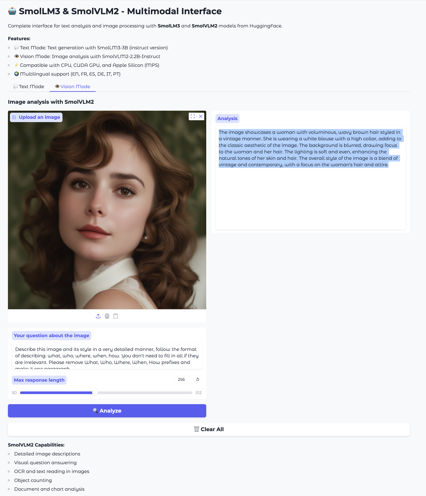

# 🤖 SmolLM3 & SmolVLM2 - Gradio Interface

A user-friendly web interface for running [SmolLM3](https://huggingface.co/HuggingFaceTB/SmolLM3-3B) (text generation) and [SmolVLM2](https://huggingface.co/HuggingFaceTB/SmolVLM2-2.2B-Instruct) (vision analysis) models locally on your computer.

> **📌 Recent Updates (2025-01)**
> - ✅ **NEW: Extended Thinking Mode** - See how the model reasons through problems
> - ✅ Fixed SmolVLM2 model loading (now uses `AutoModelForImageTextToText`)
> - ✅ Updated to use `dtype` parameter instead of deprecated `torch_dtype`
> - ✅ Updated minimum transformers version to 4.53.0
> - ✅ Added comprehensive troubleshooting section

## ✨ Features

- 💬 **Text Generation**: Chat with SmolLM3-3B, a powerful 3B parameter language model
- 🧠 **Extended Thinking Mode**: Watch the model's reasoning process in real-time (enabled by default)
- 👁️ **Vision Analysis**: Analyze images with SmolVLM2-2.2B for descriptions, OCR, and visual Q&A
- 🌍 **Multilingual Support**: Works with 6 languages (English, French, Spanish, German, Italian, Portuguese)
- ⚡ **Hardware Acceleration**: Automatic support for CUDA (NVIDIA), MPS (Apple Silicon), or CPU
- 🎨 **User-Friendly Interface**: Clean Gradio web UI accessible from any browser
- 🔒 **Privacy-First**: Runs completely locally, no data sent to external servers



## 📋 Requirements

### Minimum Requirements
- **OS**: Windows 10/11, macOS 11+, or Linux
- **RAM**: 16 GB (8 GB may work but slower)
- **Storage**: 15 GB free space (for models)
- **Python**: 3.10, 3.11, or 3.12

### Recommended Requirements
- **RAM**: 32 GB
- **GPU**: 
  - NVIDIA GPU with 8+ GB VRAM (RTX 3060 or better)
  - Apple Silicon (M1/M2/M3) with 16+ GB unified memory
- **Storage**: 20 GB free space (SSD recommended)

## 🚀 Quick Start

### macOS / Linux

```bash
# 1. Clone or download this repository
git clone https://github.com/yourusername/smollm-gradio.git
cd smollm-gradio

# 2. Run the installation script
chmod +x install.sh
./install.sh

# 3. Start the application
./start.sh
```

### Windows

```cmd
# 1. Clone or download this repository
git clone https://github.com/yourusername/smollm-gradio.git
cd smollm-gradio

# 2. Run the installation script
install.bat

# 3. Start the application
start.bat
```

### Manual Installation

If the automated scripts don't work, follow these steps:

```bash
# Create virtual environment
python3 -m venv venv

# Activate it
# On Mac/Linux:
source venv/bin/activate
# On Windows:
venv\Scripts\activate

# Upgrade pip first
pip install --upgrade pip

# Install dependencies (minimum versions required)
pip install torch>=2.0.0 torchvision>=0.15.0
pip install transformers>=4.53.0
pip install gradio>=4.0.0
pip install pillow sentencepiece protobuf einops

# Or install everything at once from requirements.txt
pip install -r requirements.txt

# Run the application
python3 smollm3-gradio-app.py
```

**Important:** Make sure you have at least:
- `transformers>=4.53.0` (required for SmolVLM2 support)
- `torch>=2.0.0` (required for modern PyTorch features)
- `gradio>=4.0.0` (for the web interface)

## 📖 Usage

1. **Launch the application** using `start.sh` (Mac/Linux) or `start.bat` (Windows)
2. **Open your browser** and go to: `http://localhost:7860`
3. **Choose a mode**:
   - **Text Mode**: Type your question or prompt and generate responses
   - **Vision Mode**: Upload an image and ask questions about it

### Extended Thinking Mode

SmolLM3 now features **Extended Thinking Mode**, which shows you how the model reasons through problems before giving the final answer.

- **Enabled by default**: The "Enable Extended Thinking" checkbox is checked when you start
- **How it works**: The model's internal reasoning appears in an expandable "🧠 Thinking Process" section below the response
- **Toggle anytime**: Simply check/uncheck the box to enable or disable this feature
- **Benefits**:
  - Understand how the model arrived at its answer
  - Verify the reasoning process
  - Educational insight into AI decision-making
  - Useful for debugging complex queries

**Example**: When you ask "Explain quantum entanglement", you'll see:
- **Response**: The clear, final explanation
- **Thinking Process** (in accordion): The model's step-by-step reasoning, breaking down the concept

#### Technical Details: `/think` and `/no_think` System Prompts

SmolLM3 uses special system prompts to control the extended thinking feature:

- **`/think`** (default): Enables extended thinking mode
  - Model generates reasoning within `<think>...</think>` tags
  - Final answer appears after the thinking process
  - Useful for complex problems, debugging, and educational purposes

- **`/no_think`**: Disables extended thinking mode
  - Model generates direct answers without showing reasoning
  - Faster responses
  - Better for simple queries or when you just need the answer

**Usage in code:**
```python
# With extended thinking (default)
messages = [
    {"role": "system", "content": "/think"},
    {"role": "user", "content": "Your question here"}
]

# Without extended thinking (faster)
messages = [
    {"role": "system", "content": "/no_think"},
    {"role": "user", "content": "Your question here"}
]
```

The interface handles this automatically when you toggle the "Enable Extended Thinking" checkbox.

### First Launch

⏱️ **Important**: The first launch will download ~10 GB of model files. This takes 15-20 minutes depending on your internet connection. Subsequent launches are instant as models are cached.

## 🎯 Example Use Cases

### Text Generation
- Creative writing and storytelling
- Code generation and debugging
- Explanations and educational content
- Language translation
- Question answering

### Vision Analysis
- Image description and captioning
- OCR (text extraction from images)
- Visual question answering
- Object counting and identification
- Document analysis

## ⚙️ Configuration

### Changing the Port

Edit `app.py` and modify the last line:

```python
demo.launch(
    server_name="0.0.0.0",
    server_port=7860,  # Change this to your preferred port
    share=False
)
```

### Enabling Public Sharing

To create a temporary public link (via Gradio):

```python
demo.launch(
    server_name="0.0.0.0",
    server_port=7860,
    share=True  # Change to True
)
```

### Memory Optimization

If you're running out of memory, you can reduce the maximum generation length in the UI or modify the model loading code to use quantization.

## 🔧 Troubleshooting

### Issue: "Command not found: python3"
**Solution**: Try `python` instead of `python3`, or install Python from [python.org](https://www.python.org/downloads/)

### Issue: "Unrecognized configuration class SmolVLMConfig"
**Solution**: This was fixed in the latest version. Make sure you're using the updated code with `AutoModelForImageTextToText` for SmolVLM2:
```bash
pip install --upgrade transformers>=4.53.0
```

### Issue: "torch_dtype is deprecated"
**Solution**: This warning is fixed in the latest code. The parameter has been changed from `torch_dtype` to `dtype`.

### Issue: "SmolVLMModel object has no attribute 'generate'"
**Solution**: This means you're using the wrong model class. Make sure the code uses `AutoModelForImageTextToText` instead of `AutoModel` or `AutoModelForCausalLM` for SmolVLM2.

### Issue: "CUDA out of memory"
**Solution**:
- Close other applications
- Reduce the max generation length in the UI
- Use a smaller batch size
- Consider using `dtype=torch.float32` instead of `torch.float16`

### Issue: Models downloading very slowly
**Solution**:
- Check your internet connection
- Consider downloading models manually from HuggingFace
- Models are cached in `~/.cache/huggingface/`
- You can optionally install `hf_xet` for better performance: `pip install hf_xet`

### Issue: "ModuleNotFoundError" errors
**Solution**:
```bash
source venv/bin/activate  # Mac/Linux
# or
venv\Scripts\activate  # Windows

pip install -r requirements.txt
```

### Issue: Interface is slow on CPU
**Solution**: This is expected. Consider:
- Using a machine with a GPU
- Reducing generation length
- Being patient (CPU inference is 10-30x slower than GPU)

## 📚 Model Information

### SmolLM3-3B
- **Parameters**: 3 billion
- **Context Length**: 64K tokens (up to 128K with YARN)
- **Languages**: EN, FR, ES, DE, IT, PT
- **Extended Thinking**: Supports `/think` and `/no_think` system prompts for reasoning traces
- **License**: Apache 2.0
- **Source**: [HuggingFace](https://huggingface.co/HuggingFaceTB/SmolLM3-3B)

### SmolVLM2-2.2B-Instruct
- **Parameters**: 2.2 billion
- **Vision Encoder**: SigLIP (384x384)
- **Capabilities**: Image & video understanding
- **License**: Apache 2.0
- **Source**: [HuggingFace](https://huggingface.co/HuggingFaceTB/SmolVLM2-2.2B-Instruct)

## 🤝 Contributing

Contributions are welcome! Please feel free to submit a Pull Request.

## 📄 License

This project is licensed under the MIT License. The models (SmolLM3 and SmolVLM2) are licensed under Apache 2.0 by HuggingFace.

## 🙏 Acknowledgments

- [HuggingFace](https://huggingface.co/) for the SmolLM3 and SmolVLM2 models
- [Gradio](https://gradio.app/) for the UI framework
- The open-source AI community

## 📞 Support

- **Issues**: Open an issue on GitHub
- **Discussions**: Use GitHub Discussions
- **Documentation**: Check [HuggingFace Model Cards](https://huggingface.co/HuggingFaceTB)

## 🔗 Links

- [SmolLM3 Blog Post](https://huggingface.co/blog/smollm3)
- [SmolVLM Blog Post](https://huggingface.co/blog/smolvlm)
- [Gradio Documentation](https://gradio.app/docs)
- [Transformers Documentation](https://huggingface.co/docs/transformers)

---

**Made with ❤️ by the community**
